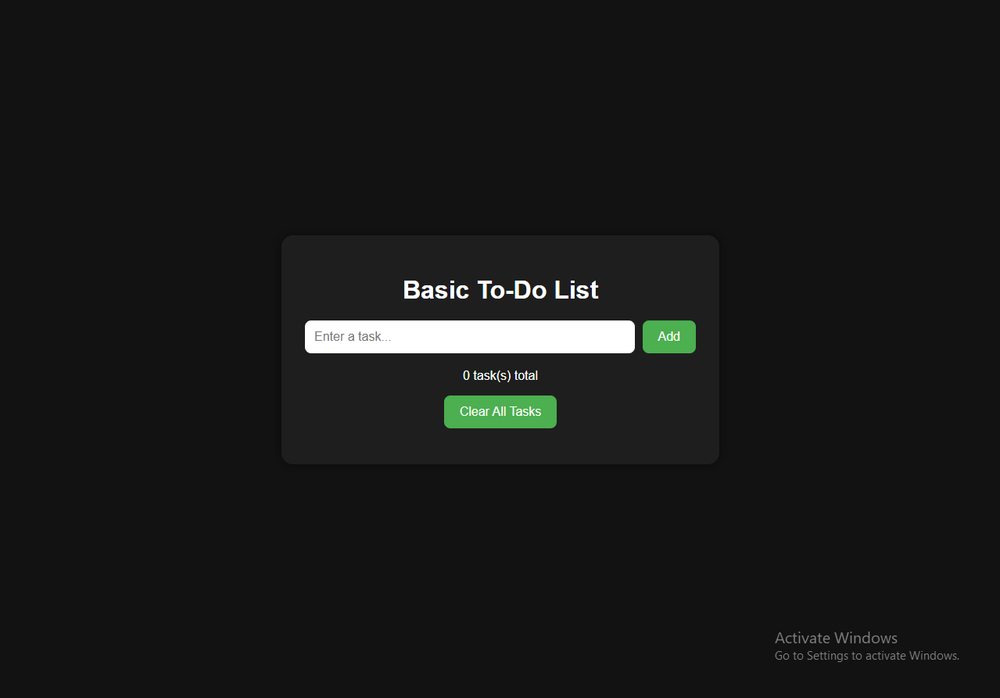
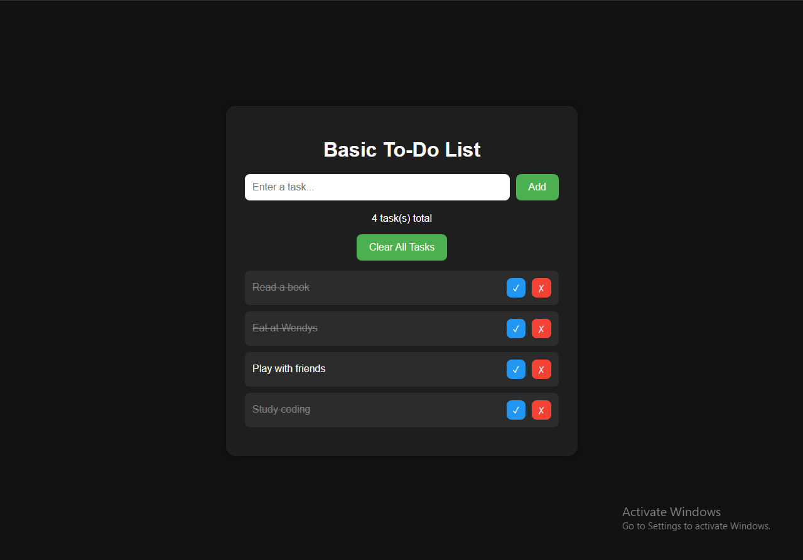

# To-Do List Web App 

A clean, responsive, and interactive To-Do List web application built using **HTML, CSS, and JavaScript**.  
This project demonstrates core front-end development concepts such as DOM manipulation, local storage, and user interaction design.

Date of Creation: May 4, 2026
---

## Features

- Add new tasks
- Edit existing tasks
- Mark tasks as completed
- Delete tasks
- Undo delete functionality
- Drag and drop reordering
- Persistent storage using localStorage
- Task filtering (All / Active / Completed)
- Task counter
- Responsive UI design

---

## Built With

- HTML5
- CSS3
- JavaScript (Vanilla)

---

## Preview

---

## What I Learned

- DOM manipulation and event handling
- Managing application state in JavaScript
- Using localStorage for persistence
- Building interactive UI components
- Implementing drag-and-drop functionality
- Structuring scalable front-end projects

---

## Future Improvements

- Cloud sync using backend API
- User authentication
- Dark/light theme toggle
- Task due dates & reminders

---

## Author

Built by: **jinn-31**  
Aspiring Software Developer focused on web and software development.

---

## 📌 Note

This project is part of my learning journey to build real-world software development skills and freelance-ready portfolio projects.
